# FunboxEasy
##### https://portal.offensive-security.com/labs/play


Lets run an nmap scan on the ip to gather some information on the box

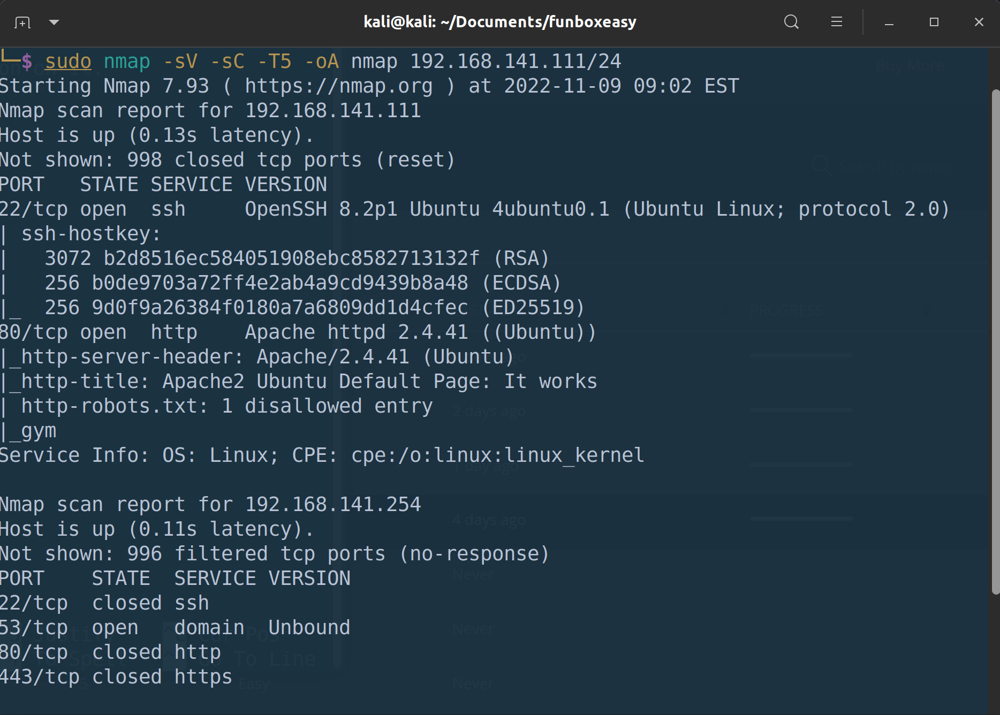


We see an apache server is running on port 80, 443 and an ssh on 22. 
Since ssh is a new version and not a very wide attack service let start 
by checking out the webserver and visit the site. 

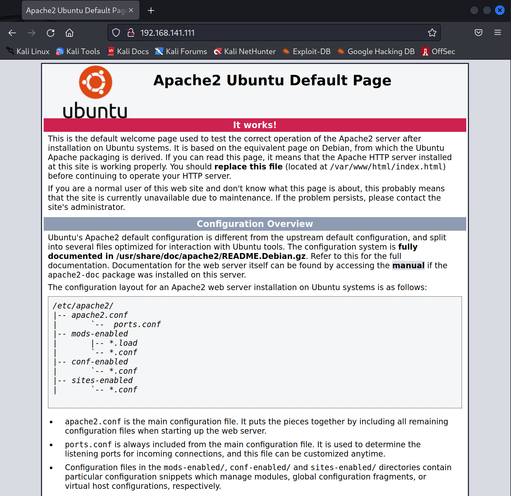


Default apache page, lets do some directory discovery 

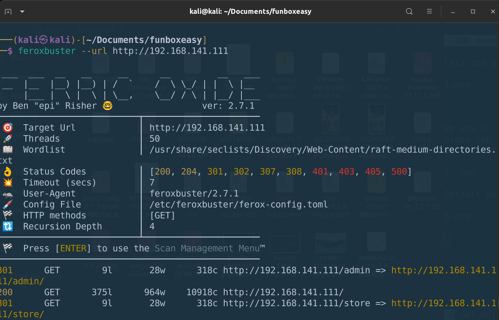


The admin page looks interesting, lets check that out first. 

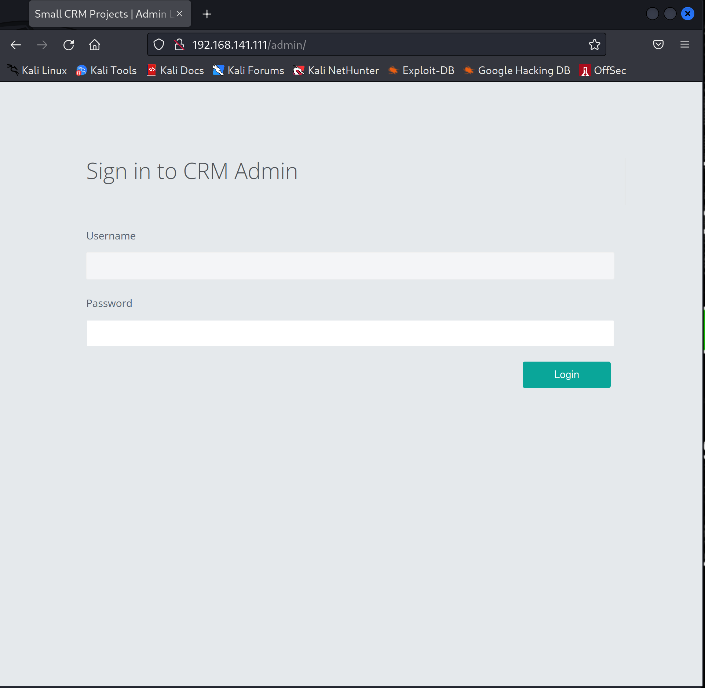


I tried some obvious default creds (admin:admin, admin:password, etc...) without
success, lets go checkout the store directory. 

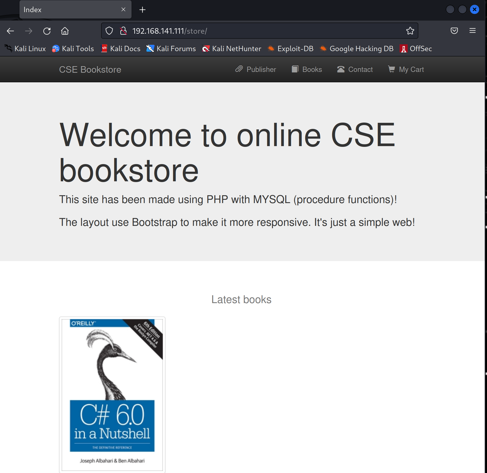


I see PHP and SQL are mentioned which immidiatly makes me thing sqli ---> php reverse shell as out way in,
scrolling down more theres an admin login link, we are greeted with a login page
lets try sqli to bypass the password.

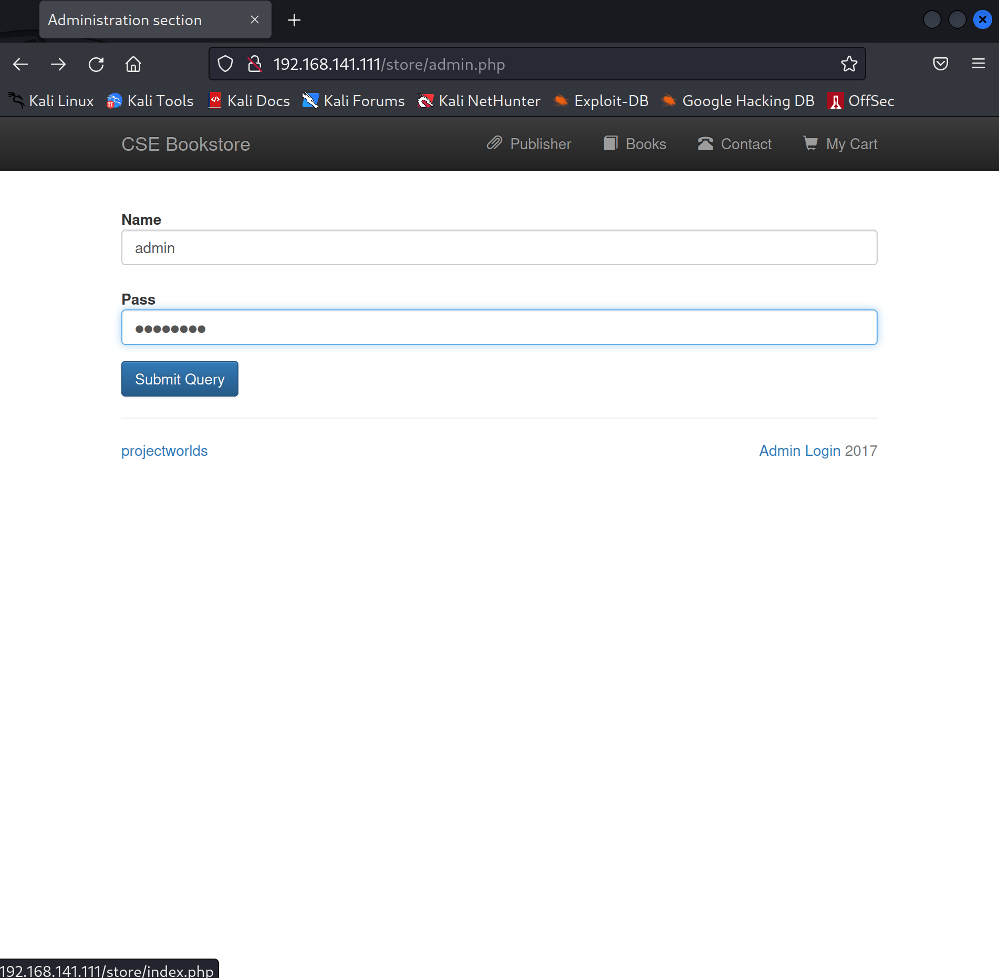


user: admin
pass: 'OR 1=1-

Success! we are in the backend.
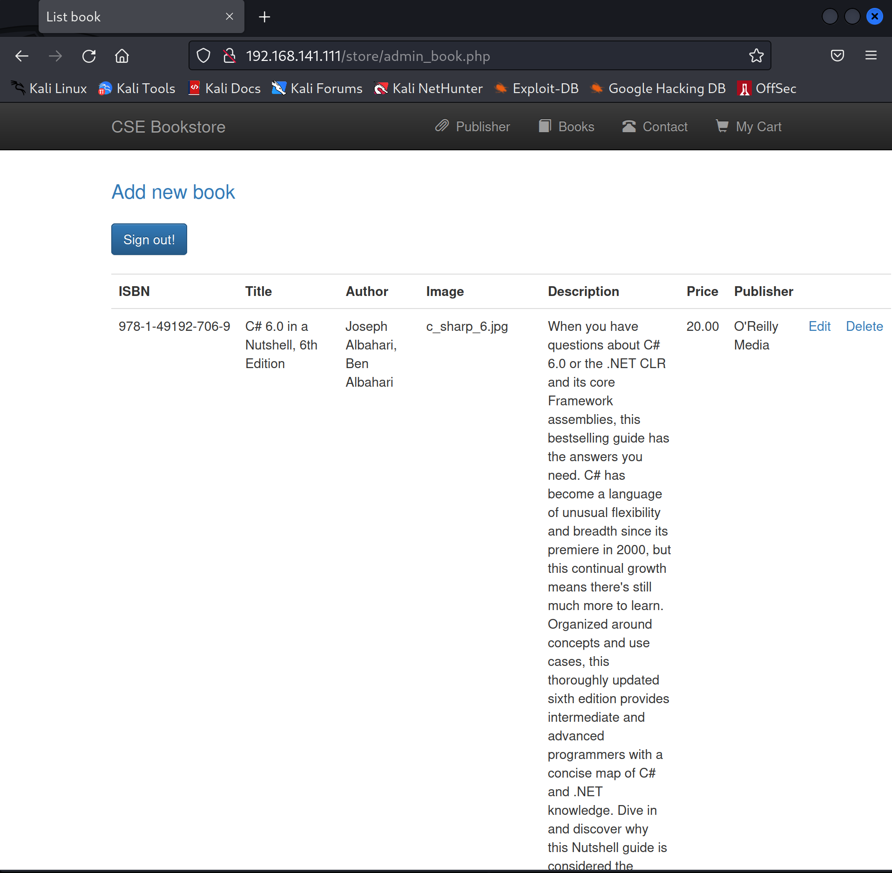


Lets see if we can find an upload form or something. 
Looks like we can add a new book, maybe we can put our shell here.

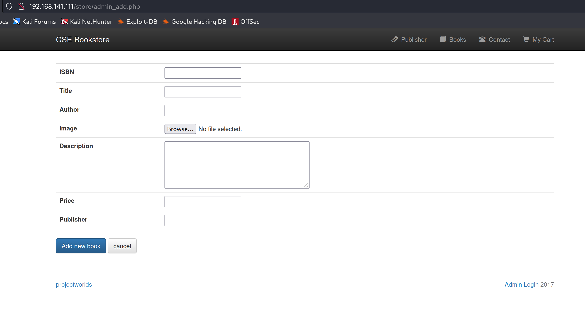
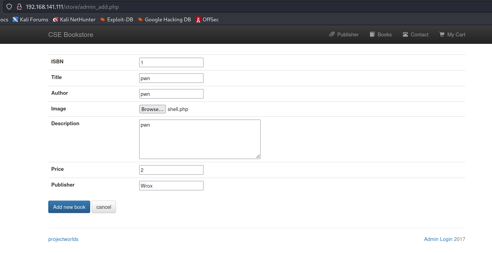

Im using this php shell from pentest monkey:
https://github.com/pentestmonkey/php-reverse-shell/blob/master/php-reverse-shell.php

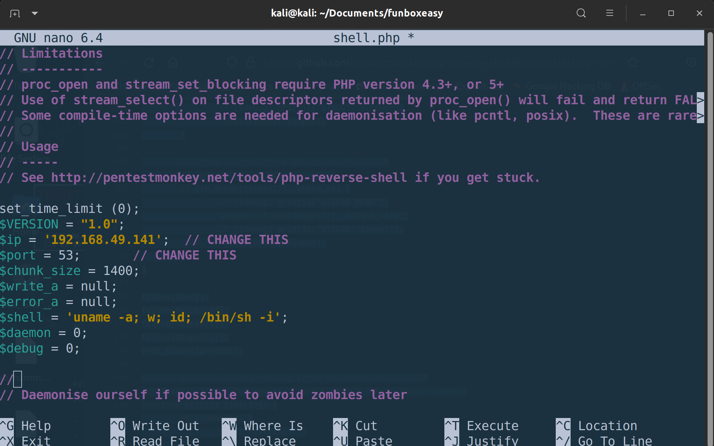


start a listener! 

```shell
nc -lvnp 53
```

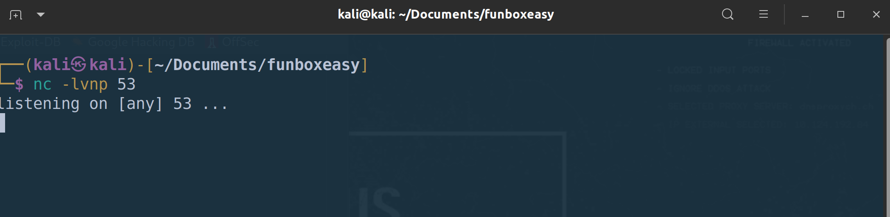


Lets upload our shell, upload worked, the code should run server side if we visit the books listing. 


Got a shell! Lets upgrade it with python 
```shell
python3 -c 'import pty; pty.spawn("/bin/bash")'
```

User flag is in /var/www/local.txt

```shell
cat local.txt
```

now lets snoop around and to try to get some more access. 
found password.txt in /home/tony/ that contains tony's ssh info. lets login as tony

ssh: REDACTED
gym/admin:  REDACTED
/store: REDACTED

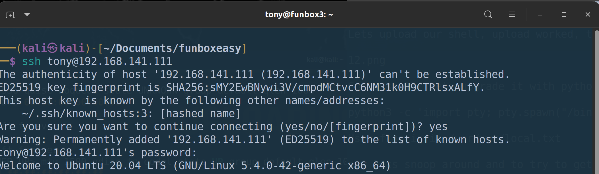


Now we are tony, lets check if tony has sudo perms 
```shell
sudo -l
```


Looks like we have some options here, lets try to spawn a root shell with yelp first and move from there
I tried a few programs, the only one that seems to exist is 'time' so lets try that one. 

```bash
sudo time /bin/sh
```

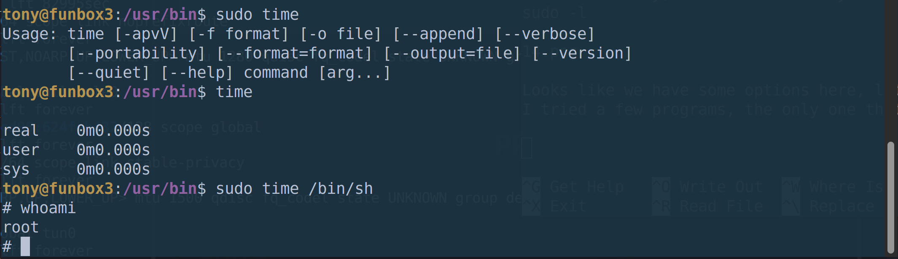

we got ROOT! 

Root flag: /root/proof.txt

An easy box to get started and go through the general steps of a pentest. 
