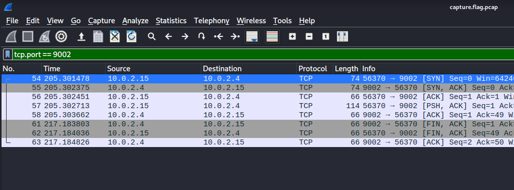
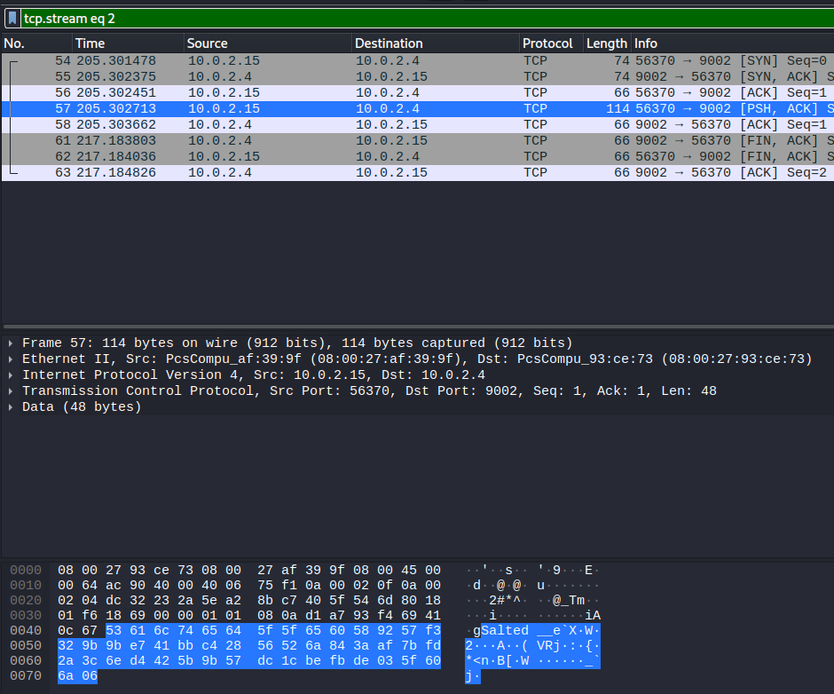

# picoCTF 2022 Eavesdrop
### Problem ###
Download this packet capture and find the flag.
	- capture.flag.pcap

### Research ###
Opening the pcap in wireshark, we see plenty of TCP packets.

Clicking on the first packet and loking at its plaintext in wireshark we see:
``````
"Hey, how do you decrypt this file again?"
``````
**right click --> follow --> TCP Stream** lets us view the entire conversation. 

It looks like two people messaging each other over an unencrypted protocol. 

reading on we come to this line:

``````
openssl des3 -d -salt -in file.des3 -out file.txt -k supersecretpassword123
``````
Looks like we are going to need to find the file being sent and decrypt it with openssl to get the flag. 

### Solution ###
Reading the rest of the conversation, we see:

``````
Oh great. Ok, over 9002?
``````

Assuming they mean _port 9002_ we close out the TCP Stream and use a display filter as follows:


Now we only have a few packets to look through

Clicking through the packets we find one that looks like this: 




**The next few steps are very important**

1. We have to export this packet
2. No, you cannot copy and paste the ASCII text into a file you will waste a lot time doing this!
3. **Select the packet --> Select "Data" in the middle pane --> right click --> Export Packet Bytes --> Save as "flag.des3"**

Now lets run that command we found earlier on our **flag.des3** file 

``````bash
openssl des3 -d -salt -in flag.des3 -out file.txt -k supersecretpassword123
``````

Generated a file.txt file lets read it

``````bash
cat file.txt 
picoCTF{nc_73115_411_445e5629}
``````

### Flag ###
**picoCTF{nc_73115_411_445e5629}**


