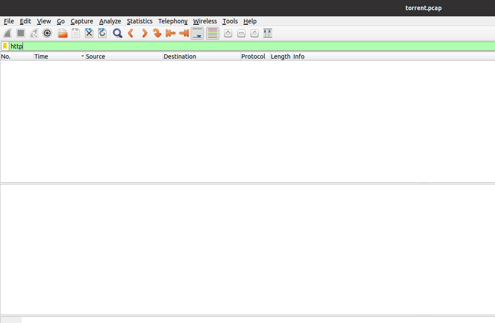
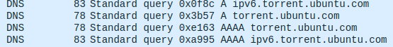
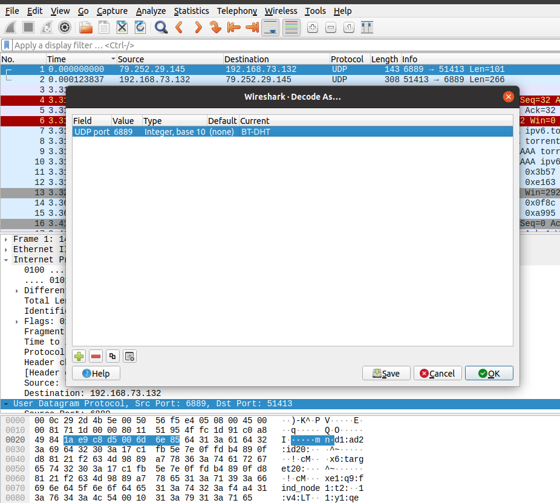
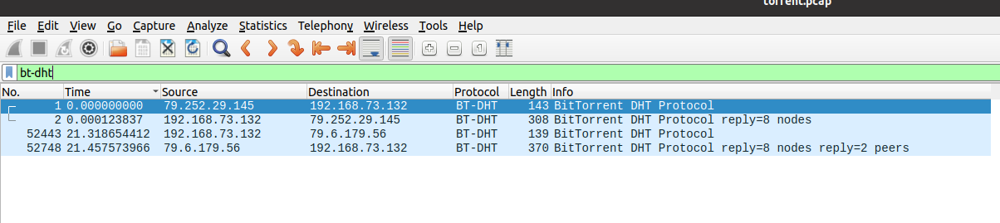
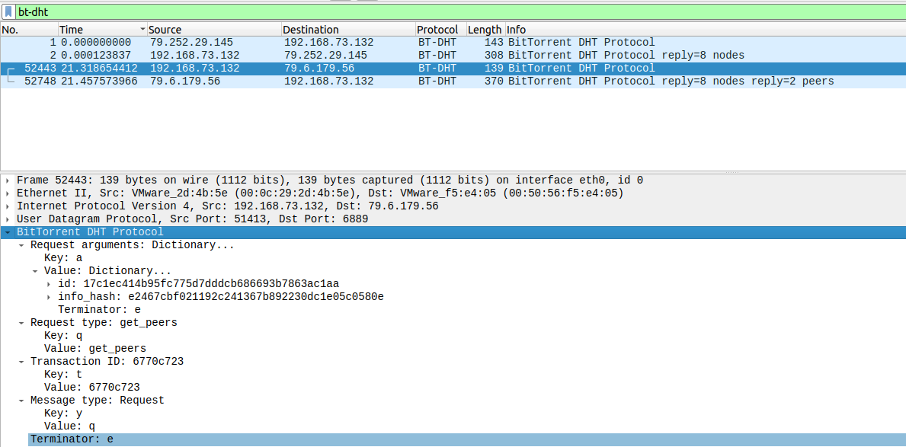

    

# **PicoCTF 2022 – Torrent Analyze**
Forensics

### **Problem**

SOS, someone is torrenting on our network. One of your colleagues has been using torrent to download some files on the company’s network. Can you identify the file(s) that were downloaded? The file name will be the flag, like `picoCTF{filename}`.

- torrent.pcap

### **Research**
(I spent a lot of time researching on this one, lots of new information)

We know we are looking at some sort of torrent download so we can start with general research about how BitTorrent works:

[https://en.wikipedia.org/wiki/BitTorrent](https://en.wikipedia.org/wiki/BitTorrent)

We know torrents need peers and trackers to function properly

[https://en.wikipedia.org/wiki/BitTorrent_tracker](https://en.wikipedia.org/wiki/BitTorrent_tracker)

Trackers keep track of which peers have which portions of the file, we also learn trackers have an “announce” HTTP packet that lists the tracker name and the file being downloaded. Looking at our pcap in Wireshark we don’t see any “announce” HTTP packet

  

  
BUT we do have some DNS query’s to the Ubuntu torrent repo so we can safely assume we are looking for an iso related to ubuntu.

  

How could this torrent be _**trackerless**_?

**Distributed Hash Tables! (DHT)**

[https://en.wikipedia.org/wiki/Distributed_hash_table](https://en.wikipedia.org/wiki/Distributed_hash_table)

How does the DHT protocol verify the validity of a file?

[https://www.usenix.org/legacy/event/woot10/tech/full_papers/Wolchok.pdf](https://www.usenix.org/legacy/event/woot10/tech/full_papers/Wolchok.pdf)

That article mentions an “info_hash” used to identify files, now we have something to look for!

### **Solution**

Lets setup Wireshark to decode the Bittorrent DHT packets:
Sort packets by time, right click on the first UDP packet, select “Decode As”
change the “current” to BT-DHT and make sure everything matches the screenshot below:

  

    

  

 Ok, now lets filter the packets by **BT-DHT**

  

We know nothing can happen until after peers are connected and we can assume before the download starts we would need to know if the info hash matches. We choose the packet just before the 2 peers reply. We get the following

  

Found the info hash!

**info_hash: e2467cbf021192c241367b892230dc1e05c0580e**

Now we have to find which iso has that hash, introducing linuxtracker.org.

Linuxtracker.org maintains a huge index of linux images and hashes.

You can find any image by putting its info hash at the end of this URL.

[https://linuxtracker.org/index.php?page=torrent-details&id](https://linuxtracker.org/index.php?page=torrent-details&id)[=](https://linuxtracker.org/index.php?page=torrent-details&id=SHA1)**{INSERT HASH HERE}**

[https://linuxtracker.org/index.php?page=torrent-details&id=e2467cbf021192c241367b892230dc1e05c0580e](https://linuxtracker.org/index.php?page=torrent-details&id=e2467cbf021192c241367b892230dc1e05c0580e)

#### Flag
**picoCTF{ubuntu-19.10-desktop-amd64.iso}**
